# The WHY Loop

## A structured reasoning framework to go from goals to actions – by Lorenzo Mugnai

The WHY Loop is a modular thinking system that helps you clarify any goal, identify what is truly needed to reach it, and distinguish between what helps and what hinders — all by asking *Why?* at every level. It turns complex, ambiguous challenges into a traceable sequence of justified actions.

---

## 🔄 Structure

Each **WHY Loop Cell** represents a self-contained unit of reasoning. You can chain or nest multiple cells to explore sub-actions or complex goals.

1. **GOAL** – What do you want to achieve?  
   → *Why do you want to achieve it?*

2. **NEED** – What do you need to make this goal achievable?  
   → *Why is this need necessary?*

3. **STRATEGIC BIFURCATION** – For each need:

   **A. What could help satisfy the need?**  
   → Why would it help?  
   → Under what assumptions or conditions?  
   → ⤷ If it’s *not difficult to achieve*, it becomes a valid action  
   → ⤷ If it *is* difficult, open a new WHY Loop Cell to explore it further

   **B. What could work against the satisfaction of the need?**  
   → Why might it work against it?  
   → Can this be avoided?  
   → ⤷ If *yes*, the avoidance becomes a valid action  
   → ⤷ If *no*, the goal cannot be achieved — the cell collapses

**Valid actions** emerge only from viable and traceable branches.  
If a branch becomes too complex or uncertain, open a new cell. The WHY Loop is **recursive** by design.

---

## 📊 Visual Overview

This diagram shows the structure of a single WHY Loop Cell: a unit of reasoning that helps you go from a goal to grounded, testable actions.

```mermaid
flowchart TD
    GOAL(["GOAL<br>What do you want to achieve?<br><b>Why</b> do you want to achieve it?"]) --> NEEDS(["NEEDS<br>What do you need to achieve your goal?<br><b>Why</b> do you need to satisfy this?"])
    NEEDS --> HELP(["What would <b>help</b> you to satisfy the need?<br><b>Why</b> would this help?"]) & RISK(["What would <b>work against</b> the need?<br><b>Why</b> would it work against?"])
    NEEDS -.-> GOAL
    HELP --> DIFF{"Is it difficult to achieve?"}
    HELP -.-> NEEDS
    DIFF -- NO --> ACT1[/"✅ This is an action"/]
    DIFF -- YES --> NEWCELL["Start a new WHY Loop Cell<br><i>Break down complexity or test feasibility</i>"]
    RISK --> AVOID{"Is it possible to avoid?"}
    RISK -.-> NEEDS
    AVOID -- YES --> ACT2[/"✅ Avoid this: it is an action"/]
    AVOID -- NO --> FAIL["🚫 The GOAL cannot be achieved.<br>This need cannot be satisfied.<br>The goal must be re-evaluated."]

     GOAL:::cell
     NEEDS:::cell
     HELP:::cell
     RISK:::cell
    classDef cell fill:#f9f9f9,stroke:#ccc,stroke-width:1px
    linkStyle 0 stroke:#BBDEFB,fill:none
    linkStyle 1 stroke:#BBDEFB,fill:none
    linkStyle 2 stroke:#BBDEFB,fill:none
    linkStyle 3 stroke:#C8E6C9,fill:none
    linkStyle 5 stroke:#C8E6C9,fill:none
    linkStyle 9 stroke:#C8E6C9,fill:none
```

---

## 📘 Documentation

- [Official Framework PDF](docs/The_WHY_Loop_Framework_by_Lorenzo_Mugnai.pdf)  
- [Method Overview](docs/method.md)
- [Why the WHY Loop Works](docs/power.md)
- [Context and Comparison with Other Frameworks](docs/context.md)
- [How the WHY Loop Works in Practice](docs/cases.md)
- [Case Study: Power System Design](docs/examples/power.md)
- [Case Study: Apollo 13 Historical](docs/examples/apollo13_case.md)
- [Case Study: Burnout](docs/examples/burnout.md)
- [Case Study: Career transition](docs/examples/career_transition.md)
- [Case Study: University learning strategy](docs/examples/learning_strategy.md)
- [Visual Diagram](docs/diagram.png)

---

## 📜 License

This work is licensed under a  
**Creative Commons Attribution–NonCommercial–NoDerivatives 4.0 International License (CC BY-NC-ND 4.0)**.

You may share and use this framework for personal, academic, or non-commercial purposes, provided that appropriate credit is given and no modifications are made.  
**Commercial use** (including training, consulting, resale, or inclusion in paid materials) requires prior written permission from the author.

---

**Author**: Lorenzo Mugnai  
**First published**: 7 June 2025

---

## 📩 Contact

For collaborations, commercial licensing, or workshops:  
📧 lorenzomugnai09 [at] gmail [dot] com
