# The Method

The WHY Loop is a structured reasoning tool designed to move from abstract goals to grounded, testable actions.  
It guides you through a recursive process of asking **“Why?”** at each step — to clarify, challenge, and validate your thinking.

---

## Overview of the Loop

The WHY Loop is composed of **three main steps** and can be read:

- Top-down — for analysis and planning  
- Bottom-up — for execution and action

Each step serves a precise function in turning intention into informed action.

---

## 1. GOAL — What do you want to achieve? Why?

:::tip
Start with a goal that is clear, meaningful, and measurable.
:::

Ask yourself:

- What outcome am I aiming for?
- What does success look like?
- Why is this worth pursuing?

This step sets direction.  
If the goal is vague or inherited without questioning, the rest of the structure collapses.

---

## 2. NEEDS — What must be true to reach the goal?

Break your goal into necessary conditions:

- What must be in place for this to happen?
- Are there skills, knowledge, tools, beliefs, or people required?
- Why are these truly necessary?

:::note
This step maps the logical dependencies that underpin your goal.
If even one need is unsatisfiable, the goal may need to be revised or broken down.
:::

---

## 3. STRATEGIC BIFURCATION — What helps, what hinders?

Each need is examined from two sides:

**A. What could help?**  

- What actions, tools, ideas, or strategies might satisfy the need?  
- Why would they work?  
- Under what conditions?

**B. What could work against it?**  

- What makes this fragile, risky, or uncertain?  
- Why might this fail?

:::tip
This dual approach prevents blind spots and overconfidence.  
It builds a balanced view before acting.
:::

---

## Identifying Actions

From the bifurcation, you derive **valid actions**:

- If **help** is feasible and not overly complex, it becomes an action.
- If **risk** can be avoided, that avoidance is also an action.
- If a need is too complex or uncertain, open a new WHY Loop Cell to explore it further.

## Unsatisfiable Needs

:::caution
If no viable strategy can be found for a need:
> The goal must be revised, decomposed, or abandoned.
:::

This protects you from investing time or energy in goals that are structurally impossible.

---

## Recursive and Iterative Use

Every action generated by the loop can itself become a new WHY Loop.

- Want to apply for funding? Use the loop.  
- Want to prepare your proposal? Use the loop.  
- Want to decide between two projects? Use the loop.

:::note
The WHY Loop is scalable.  
It can be used at any level: personal, team, organizational, or strategic.
:::

---

## Reading the WHY Loop in Two Directions

The WHY Loop is not just a way to plan@ it’s a way to think.

You can **read it top-down** to clarify what you're aiming for, what must be true, and what might help or hinder your progress.
This direction is for analysis and construction: it helps identify the real problem and the actions that follow from it.

But you can also **read it bottom-up** to execute.
Starting from an action, trace your way back through the chain of needs and goals, verifying that what you’re doing still makes sense.
This direction is for validation and coherence: it confirms whether an action is aligned with its purpose.

Top-down: **What must be true**?
Bottom-up: **Why does this matter**?

This dual flow makes the WHY Loop both a creative and a critical tool, to build, and to test.

```mermaid
flowchart TD
    GOAL["🎯 GOAL<br/>What do you want to achieve?"] 
    NEEDS["🔎 NEEDS<br/>What must be true to reach it?"] 
    BIFUR["⚖️ BIFURCATION<br/>What helps? What hinders?"] 
    ACTIONS["🚀 ACTIONS<br/>What can you do?"]

    GOAL --> NEEDS
    NEEDS --> BIFUR
    BIFUR --> ACTIONS

    ACTIONS -.-> BIFUR
    BIFUR -.-> NEEDS
    NEEDS -.-> GOAL

    COMMENT_TOP["⬇️ <b>Top-down</b><br/>Build from goals"]
    COMMENT_BOTTOM["⬆️ <b>Bottom-up</b><br/>Justify from actions"]

    COMMENT_TOP --> GOAL
    ACTIONS --> COMMENT_BOTTOM

    classDef upstroke stroke-dasharray: 5 5,stroke:#999;
    class ACTIONS,BIFUR,NEEDS,GOAL upstroke;

```

---

## The Importance of “Why”

Asking **Why?** is the engine of the entire method. It:

- Forces clarity over vagueness
- Surfaces hidden assumptions
- Avoids elegant but useless solutions
- Reinforces internal coherence
- Justifies every step with intent

:::info
Without a clear "Why", every action risks being misaligned with reality.
:::

---

## How to Use the WHY Loop

You can apply it in many contexts: decisions, project design, team planning, coaching, writing.

Here’s a basic sequence:

1. Identify your goal  
2. Map out the needs that must be true  
3. For each need, ask:  
   - What could help?  
   - What could hinder?  
4. Mark any unsatisfiable needs  
5. Extract the viable actions (3A)  
6. Re-apply the loop if any action is vague or complex

:::tip
Use metrics only if your context requires measurement.  
The WHY Loop works without them by design.
:::

---

## Related Pages

- [Why the WHY Loop Works](power.md)
- [The WHY Loop in Context](context.md)
- [Visual Diagram](diagram.png)
- [How the WHY Loop Works in Practice](cases.md)  
